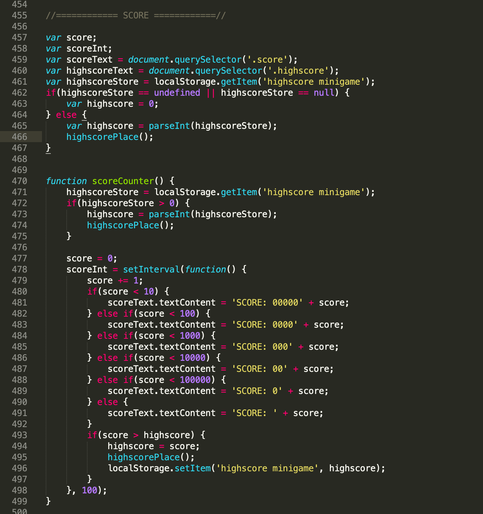

# Procesverslag
**Auteur:** Julian de Cloe

## Intro
Welkom bij mijn VR Invaders project! Een vanilla javascript Space Invaders game voor www.vrcafehaarlem.nl. Ik heb dit project gemaakt voor mijn opleiding Communication and Multimedia Design aan de Hogeschool van Amsterdam. In dit spel ben je een raketje die zo lang mogelijk moet overleven in de ruimte door sterren te ontwijken en kometen te schieten. Je kan extra punten verzamelen door coins te collecten onderweg. Ik ben een beginnend UX designer die zijn focus probeert te verdelen onder design en development. Dit is een van de eerste serieuze projecten waar ik aan werk en wil onderhouden.

## Gebruikte bronnen
1. https://developer.mozilla.org/en-US/
2. https://www.w3schools.com/
3. https://stackoverflow.com/
4. https://css-tricks.com/

## Reflectie

### Stars

Ik ben begonnen met het uitwerken van de sterren. De eerste week zat dit totaal niet mee. Ik moest ervoor zorgen dat meerdere intervallen met hetzelfde id tegelijk gestopt werden, maar dat lukte totaal niet. Na een lange zoektocht vond ik een optie waarin je met een simpele 'for loop' dit probleem kan oplossen. Ik had al eerder een 'for loop' gebruikt, maar ik had de fout gemaakt om de lengte van het id te pakken en niet het id zelf. Een interval die vaker wordt opgeroepen heeft namelijk geen lengte, maar een hoeveelheid die je kan aanroepen door het id zelf aan te roepen. Dit klinkt als een klein probleem, maar ik liep al meerdere dagen vast op dit onderdeel (in de tussen tijd ook mijn hoofd geleegd door alvast aan andere onderdelen te werken). 

### Rocket

De besturing van de raket ging vrij soepel. Het enige nadeel waar ik tegenop liep was dat als je een pijltje ingedrukt houdt de actie 1 seconde wacht voordat hij in repeat blijft uitvoeren. Ik wilde dat hij vanaf start in repeat ging, dus in plaats van het direct uitvoeren van de functie, zet je hem eerst in een timeout waarin je op het eind ook weer de functie aanroept waardoor er een loop ontstaat. Daarin maak je de functie waar de raket door beweegt. Zo start er bij keydown een animatie en bij keyup laat je de animatie weer stoppen met clearTimeout().

### Bullet

Het maken van de bullet was een chaos. Telkens als ik probeerde te spelen met intervallen raakte de kogels in de war wanneer er meer kwamen. Toen besloot ik verder te gaan met een css animatie. Toen ik alles wel werkend had gekregen kwam ik erachter dat je de offset van een geanimeerd element niet kan krijgen, dus weer terug naar intervallen proberen. Ineens besefte ik mij iets wat ik al veel eerder had kunnen beseffen. De positie van een element kun je altijd ophalen met getBoundingClientRect(). Ik heb dit in het verleden al meerdere malen gebruikt, dus ik wist al hoe het werkte. Dit was de oplossing. De bullet werkte. 

### Komeet

Het maken van de komeet ging vrij soepel. Het enige waar ik tegenaan liep was het juist afstellen van de overlapping van de raket en de komeet en de bullet en de komeet. Telkens bleek ik weer net iets te hebben omgedraaid of verkeerd te hebben gedaan. Aan het einde van het project had ik het ineens goed en bleef het goed.

### Score

Alles verliep soepel, maar 'localStorage' bleef maar niet werken. Het lukte maar niet om localStorage.getItem goed uit te voeren. Achteraf bleek dat ik deze string nog moest omzetten in waarde met parseInt().

### Coin

De coin verliep het soepelste van allemaal. Dit was dan ook de simpelste functie naar het verstoppen van de muis. Ik had een plan om css te triggeren om een kleine animatie te starten als je een coin collect. Dat werkte zoals gehoopt. Voor de rest was het vrij herhalend met intervallen en het veranderen van de top en left.

### Toekomstplannen

- In de toekomst wil ik kijken of ik de code kan inkrimpen door te zoeken naar nieuwe functies en mogelijkheden om alles even iets compacter te maken.
- In de toekomst wil ik kijken of het lukt om bij een bepaalde tijd extra sterren toe te voegen om het nog moeilijker te maken over tijd.
- In de toekomst wil ik nog kijken naar leuke sounds toevoegen
- In de toekomst wil ik meer met de bullets doen. Meer functies voor schieten. Misschien een Alien schieten?

